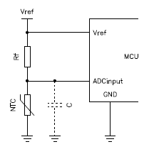

# Kettle control

## Hardware

### ESP32 devkitC V4

[Documentation](https://docs.espressif.com/projects/esp-idf/en/latest/esp32/hw-reference/modules-and-boards.html#esp32-devkitc-v4)

[ESP32 WROOM-32 datasheet](https://www.espressif.com/sites/default/files/documentation/esp32-wroom-32_datasheet_en.pdf)

#### ADC (analog to digital conversion)

The onboard ADC is not very accurate. Therefore the ADS1115 will be used from now on.

Cheap ADS1115 can be ordered on [AliExpress](https://nl.aliexpress.com/wholesale?SearchText=ads1115)

### Hothap Grill thermometer

[Hothap Grill thermometer spare sensor 6.5 inch, BBQ roasting thermometer grill thermometer probe waterproof](https://www.amazon.nl/dp/B0865L3K7N/ref=pe_19967891_404437601_TE_item?language=en_GB)

1. High-quality food grade stainless steel probe.
1. This kitchen food thermometer is designed for high temperatures and can withstand temperatures up to 380 °C.
1. Cooking thermometer probe length: 166 mm (6 1/2 inches), hybrid probe: monitor meat or ambient temperature (smoker / grill).
1. Cable length of the digital thermometer probe cable: 40 inch stainless steel grid cable.
1. Waterproof thermometer hybrid probe.
1. 6.5 inch probe made of food grade stainless steel temperature probe.

NTC parameters:

* R~25~ = ~102500 Ω
* β = ~4000 K

See [Measuring the temperature with NTCs](https://www.giangrandi.org/electronics/ntc/ntc.shtml) for more information.

#### Control the kettle temperature

Add a resistor of 27 KΩ in series.

The temperature around 57 °C results in a linear ADC input. Which is good to measure the kettle temperature between 20 and 100 °C.

#### Control the fridge temperature

Add a resistor of 150 KΩ in series.

The temperature around 16 °C results in a linear ADC input. Which is excellent to measure the fridge temperature.

## Check this

Bunch of interesting links: <http://awesome-micropython.com/>

ESP32 links:

* <https://github.com/lemariva/uPyLoRaWAN>
* <https://github.com/tve/mqboard> or <https://github.com/miketeachman/micropython-thingspeak-mqtt-esp8266>
* <https://github.com/tve/esp32-backtrace>

VSCode links:

* <https://github.com/BradenM/micropy-cli>
* <https://github.com/Josverl/micropython-stubber>
* <https://marketplace.visualstudio.com/items?itemName=dphans.micropython-ide-vscode>
* <https://marketplace.visualstudio.com/items?itemName=SWC-Fablab.micropython-replink>

Shell on host:

* <https://github.com/dhylands/rshell>
* <https://github.com/scientifichackers/ampy>
* <https://github.com/wendlers/mpfshell>
* <https://micropython.org/webrepl>

## Board info

<https://randomnerdtutorials.com/esp32-pinout-reference-gpios/>
